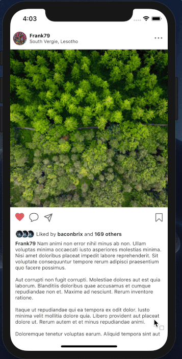

# InstaClone

A basic Instagram (Unsplash) clone utilizing Reason React Native, React Navigation, Storybook with Apollo & genType.

Running App Story requires running Unsplash GraphQL server: `yarn server`

Remaining stories can be run without any server as the resolver are mocked locally.

|                  Storybook                 |                Navigation                |
| :----------------------------------------: | :--------------------------------------: |
|  |  |
